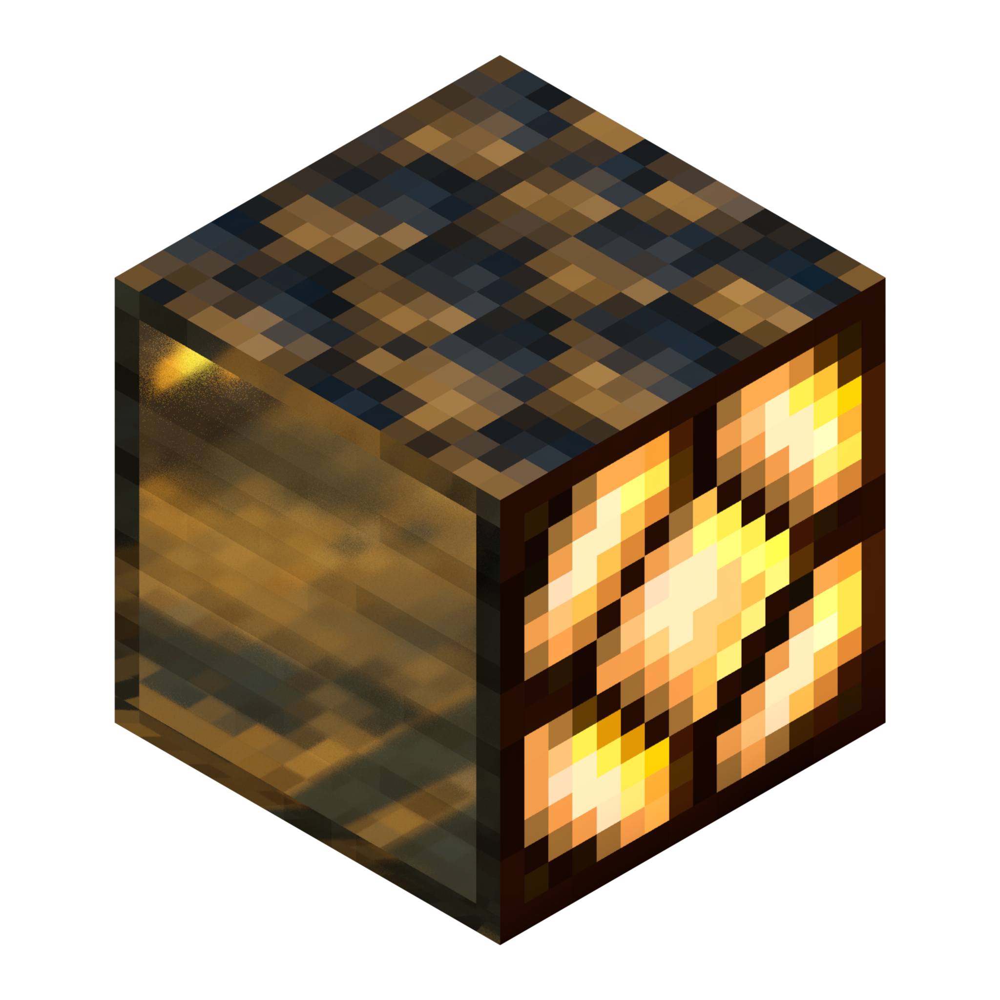

  
   
  
  
  

**Vanilla Raytraced** adds PBR resources to Minecraft.  
It provides reflections, roughness and emissive light to your world while maintaining the vanilla look of Minecraft.

> **This resource pack only works on cards compatible with RTX.**  
> If you encounter bugs while using this pack, please open an issue

## Compatible addons

**Addons must imperatively be placed on top of Vanilla Raytraced**

|                                                                                         Icon                                                                                  |                                                      Addon                                                      |          Author          |
|:-----------------------------------------------------------------------------------------------------------------------------------------------------------------------------:|:---------------------------------------------------------------------------------------------------------------:|:------------------------:|
|                   | [Mirror Addon for Vanilla Raytraced](https://github.com/MazeWave/Vanilla-Raytraced-Addons-Mirror)               |         MazeWave         |
|             | [Clean Glass Addon for Vanilla Raytraced](https://github.com/MazeWave/Vanilla-Raytraced-Addons-Glass)           |         MazeWave         |
|  | [Bloody Nether Addon for Vanilla Raytraced](https://github.com/MazeWave/Vanilla-Raytraced-Addons-Bloody-Nether) |         MazeWave         |
|  | [Luminous Ores Addon for Vanilla Raytraced](https://github.com/MazeWave/Vanilla-Raytraced-Addons-Luminous-Ores) |         MazeWave         |

> *To create your own addon you can use [this template](https://github.com/06Games/VRP-Addon-Template).*  
> *If you wish to appear in this table, you are free to make a pull request.*

## Questions and Answers

**Q: Will the texture pack be updated to newer version ?**  
A: Yes, of course, this pack will be kept up to date as long as possible.  

**Q: I installed the pack but nothing happens**  
A: Please verify that you are using Minecraft version **1.16.200 or later** and that your graphics card meets the [technical specifications](https://help.minecraft.net/hc/en-us/articles/360052769812-Minecraft-with-Ray-Tracing-Technical-Requirements) required for RTX to work.     

**Q: My question is not covered by this FAQ**  
A: Open an issue, we will be happy to answer you as soon as possible

## Development
To build the pack, just run the `make.ps1` file and once the process is complete you will find the `.mcpack` inside `.temp/export/`  
If you want to contribute to the pack, you are free to make a pull request

## Donation
All of our work is done on a voluntary basis and in our spare time.  
We decided to make this pack open-source because we believe that mutual community support can bring a lot and that it's in the spirit of Minecraft to share freely.  
However, if you wish to donate to us, you are free to do so at [this Paypal address](https://paypal.me/mazewave)  
A big thank you to all our donors for their support 🙏 

## Credits
**Ressource pack:** [MazeWave](https://github.com/MazeWave/)  
**Normal maps:** [MazeWave](https://github.com/MazeWave/) and [Poudingue](https://github.com/Poudingue/) [(Vanilla-Normals-Renewed-1.12)](https://github.com/Poudingue/Vanilla-Normals-Renewed-1.12)  
**Fogs:** [Evan Galli](https://github.com/06Games/) and [MazeWave](https://github.com/MazeWave/)  
**User interface:** [Evan Galli](https://github.com/06Games/)  
**Automation:** [Evan Galli](https://github.com/06Games/)  
